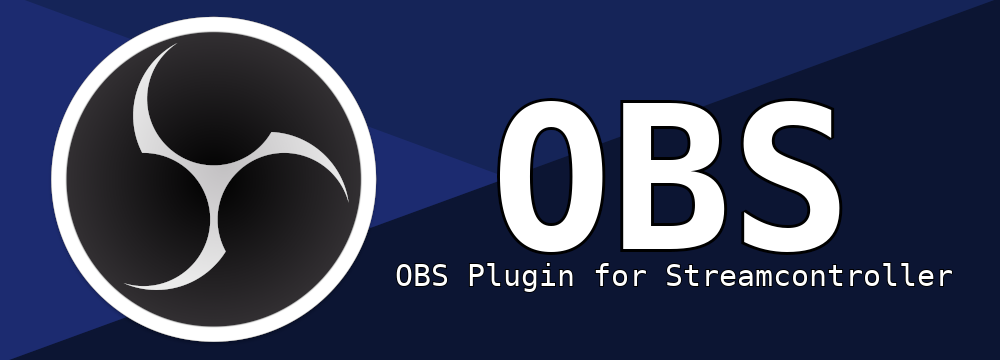

Official OBS Plugin for StreamController

Current features:
 - Custom action icons
 - show action icon instead of error when OBS is not running
 - OBS Stats action: Monitor CPU, FPS, and Bandwidth bitrate
 - OBS Connection profile
 - OBS Remote connections

Notice: Plugin was written/updated with assistance of Google Antigravity
